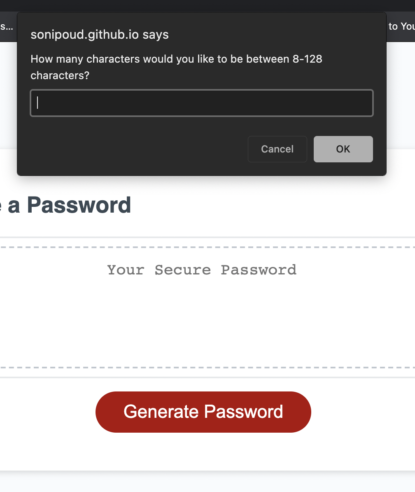
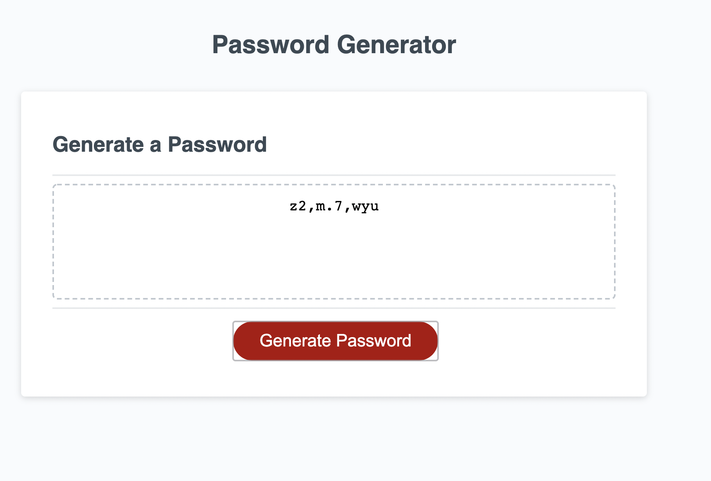

# Password Generator Starter Code

## Description
A website where a person can generate the password within the length from 8 to 128 characters that meets certain criteria in order to create a strong password that provides a greater security. There are four main variables for the strong password which includes Uppercase, lowercase, Numbers and Special characters. The person has to go through each questions and answer them to get their unique password. 

---

## Built With
* HTML
* CSS variables
* JavaScript

---

## Screenshot

---

## Website

[Password Generator System](https://sonipoud.github.io/crashgen/)

---

## Contribution
Made with love by Sonika Poudyal 
